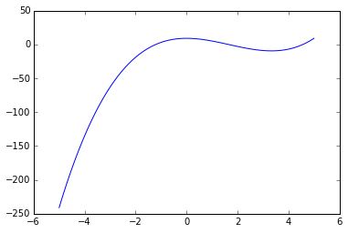
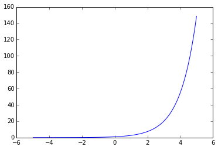

# 函数
我们可以将**函数(functions)**想象成一台机器$$f$$，我们向机器提供输入$$x$$，这台机器便会产生输出$$f(x)$$。  
这台机器所能接受的所有输入的集合称为**定义域(domain)**，所有可能输出的集合称为**值域(range)**。  

##一些函数的例子：  
1.**多项式(polynomials)**：  
$$f(x)=x^3-5x^2+9$$  
因为这是一个三次函数，当$$x\rightarrow -\infty$$ 时 $$f(x)\rightarrow -\infty$$；当$$x\rightarrow \infty$$ 时$$f(x)\rightarrow \infty$$，因此这个函数的定义域和值域都是实属集$$\mathbb{R}$$。    

在Python中，我们这样定义上面这个函数：    
```
    def f(x):
        return x**3 - 5*x**2 + 9
```
函数定义好后，我们可以测试一下其是否正确：  
```
    print f(3)
    -9
    print f(1)
    5
```
读者可以自行计算一下，与Python中我们所定义函数所给出的结果比较一下。  

通常，将函数绘制成函数图能够帮助我们理解函数的变化。  
```
    import numpy as np
    x = np.linspace(-5, 5, num = 100)
    y = f(x)
    import matplotlib.pyplot as plt
    plt.plot(x,y)
```


2.**指数函数(Exponential Functions)**  
$$exp(x)=e^x$$
其定义域为$$(-\infty,\infty)$$，值域为$$(0,\infty)$$。在Python中，可以如下方式定义指数函数：  
```
    def exp(x):
        return np.e**x
    
    print exp(2)
    7.3890560989306495
```
或者可以使用numpy模块自带的指数函数  
```
    print np.exp(2)
    7.3890560989306495
```
指数函数的函数图：  
```
    plt.plot(x, exp(x))
```



3.
4.**三角函数(Trigonometric Functions)** 


