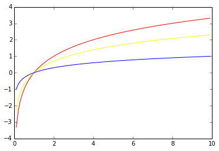
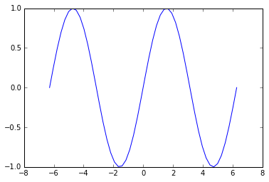
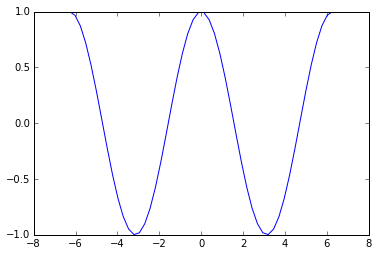

# 函数
我们可以将**函数(functions)**想象成一台机器$$f$$，每当我们向机器提供输入$$x$$，这台机器便会产生输出$$f(x)$$。  

这台机器所能接受的所有输入的集合称为**定义域(domain)**，其所有可能输出的集合称为**值域(range)**。函数的定义域和值域有着非常重要的意义，如果我们知道一个函数的定义域，便不会将不合适的输入丢给函数；知道函数的值域，便能判断一个值是否可能是这个函数所输出的。

##一些函数的例子：  
1.**多项式(polynomials)**：  
$$f(x)=x^3-5x^2+9$$  
因为这是一个三次函数，当$$x\rightarrow -\infty$$ 时 $$f(x)\rightarrow -\infty$$；当$$x\rightarrow \infty$$ 时$$f(x)\rightarrow \infty$$，因此这个函数的定义域和值域都是实属集$$\mathbb{R}$$。    

在Python中，我们这样定义上面这个函数：    
```
    def f(x):
        return x**3 - 5*x**2 + 9
```
函数定义好后，我们可以测试一下其是否正确：  
```
    print f(3)
    -9
    print f(1)
    5
```
读者可以自行计算一下，与Python中我们所定义函数所给出的结果比较一下。  

通常，将函数绘制成函数图能够帮助我们理解函数的变化。  
```
    import numpy as np
    x = np.linspace(-5, 5, num = 100)
    y = f(x)
    import matplotlib.pyplot as plt
    plt.plot(x,y)
```


2.**指数函数(Exponential Functions)**:   
$$exp(x)=e^x$$  
其定义域为$$(-\infty,\infty)$$，值域为$$(0,\infty)$$。在Python中，利用欧拉常数$$e$$可以如下方式定义指数函数：  
```
    def exp(x):
        return np.e**x
    
    print exp(2)
    7.3890560989306495
```
或者可以使用numpy自带的指数函数  
```
    print np.exp(2)
    7.3890560989306495
```
指数函数的函数图：  
```
    plt.plot(x, exp(x))
```


注意到，上面的Python定义中，我们只是利用了numpy中现成的欧拉常数$$e$$,如果没有这个神奇的常数，我们是否就无法定义指数函数了呢？答案是否定的：   
```
    def exp2(x):
        sum = 0
        for k in range(100):
            sum += float(x**k)/np.math.factorial(k)
        return sum
    
    print exp(1), exp(2), exp(3)
    2.718281828459045 7.38905609893 20.0855369232
    
    print exp2(1), exp2(2), exp2(3)
    2.7182818284590455 7.38905609893 20.0855369232
```   
上面定义中的奇妙公式：  
$$e^x = \sum_{k = 0}^{\infty}\frac{x^k}{k!}$$  
究竟是从何而来，又为何是这样的，将是本书讨论的重点之一。


3.**对数函数(Logarithmic Functions)**:  
$$log_{e}(x)=ln(x)$$  
对数函数是指数函数的反函数，其定义域为$$(0,\infty)$$，值域$$(-\infty,\infty)$$。   
numpy为我们提供了以$$2,e,10$$为底的对数函数：  
```
    x = np.linspace(0,10,100,endpoint = False)
    y1 = np.log2(x)
    y2 = np.log(x)
    y3 = np.log10(x)
    plt.plot(x,y1,'red',x,y2,'yellow',x,y3,'blue')
```


4.**三角函数(Trigonometric Functions)**:  
周期性是三角函数的特点之一，同时不同三角函数的值域和定义域也需要我们牢记，下面是Python绘制的一些三角函数的函数图：
```
    plt.plot(np.linspace(-2*np.pi,2*np.pi),np.sin(np.linspace(-2*np.pi,2*np.pi)))
```
  
```
    plt.plot(np.linspace(-2*np.pi,2*np.pi),np.cos(np.linspace(-2*np.pi,2*np.pi)))
```  
   


这里我们没有给出对数函数和三角函数的数学表达式，没有告诉大家如何在Python中定义自己的对数函数和三角函数。这并不表述我们没法这么做,想指数函数一样，我们会在后面章节为读者揭开这些奇妙函数背后的故事。
