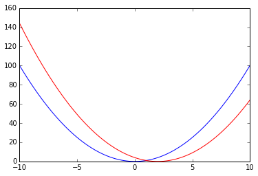

#复合函数
##**函数的复合（Composition）**:  
函数$$f$$和$$g$$的复合:$$f\circ g(x)=f(g(x))$$，可以理解为首先将$$x$$输入给函数$$g$$获得输出$$g(x)$$后将其进而输入给函数$$f$$，最终获得结果$$f(g(x))$$。

+ 几个函数的复合结果仍然是一个函数:接受输入，给出输出
+ 任何函数都可以看成是若干个函数的复合 
+ $$f\circ g(x)$$的定义域与$$g$$的定义域相同，但值域不一定与$$f$$的值域相同。


例如:$$f(x)= x+1,g(x)=x^2,h(x)=x^2+1$$,函数$$h$$可以视为$$f$$和$$g$$复合后的结果。$$f$$的值域为$$\mathbb{R}$$，但$$h$$的值域为$$(1,\infty)$$ 

在Python中我们可以很直观地对函数进行复合：

```
    def f(x): return x+1
    
    def g(x): return x**2
        
    def h(x): return f(g(x))
        
    x = np.array(range(-10,10))
    
    # 这里我们使用了Python的list comprehension来计算y
    y = np.array([h(i) for i in x])
    
    # 'bo' 将表示我们会使用蓝色的圆圈绘制点图，而非默认的线图
    plt.plot(x, y, 'bo')
```

    

我们也可以使用Python的lambda函数功能来简明地定义$$h$$:

```
    h2 = lambda x: f(g(x))
    plt.plot(x,h2(x),'rs')
```

 

##**逆函数（Inverse Function）**:  
给定一个函数$$f$$，其逆函数$$f^{-1}$$是一个与$$f$$进行复合后会得到$$f\circ f^{-1}(x)=f^{-1} \circ f (x)=x$$的特殊函数。

函数与其反函数的函数图一定是关于直线$$y=x$$对称的：
```
    w = lambda x: x**2
    winv = lambda x: sqrt(x)
    x = np.linspace(0,2,100)
    plt.plot(x, w(x),'b',x,winv(x),'r',x,x,'g-.')
```
 

##**高阶函数（Higher Order Functions）**:  
我们可以不局限于仅将数值作为函数的输入输出，函数本身也可以作为输入和输出。
```
    def horizontal_shift(f,H): return lambda x: f(x-H)
```

上面定义的函数$$\text{horizontal_shift}(f,H)$$，接受的输入是一个函数$$f$$个一个实数$$H$$，而输出是一个新的函数，新函数是将$$f$$沿着水平方向平移了距离$$H$$后得到的。

```
    x = np.linspace(-10,10,100)
    shifted_g = horizontal_shift(g,2)
    plt.plot(x,g(x),'b',x,shifted_g(x),'r')
```


以高阶函数的观点看去，函数的复合便是将两个函数作为输入给复合函数，然后由其产生一个新的函数作为输出。复合函数可以如此定义：
```
    def composite(f,g): return lambda x: f(g(x))
    h3 = composite(f,g)
    print sum(h(x)==h3(x))==len(x)
    # result: True
```
