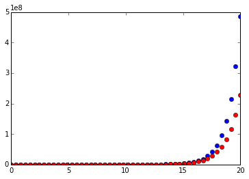
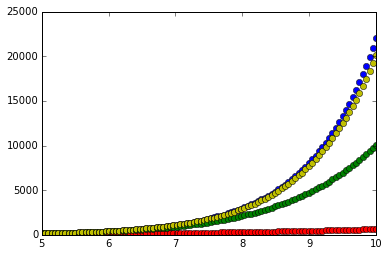

#泰勒级数
##**泰勒级数(Taylor Series)**  
在前几章的预热之后，读者可能会有这样的疑问，是否任何函数都可以写成友善的多项式形式呢？目前为止，我们介绍的$$e^x,sin(x),cos(x)$$都有其奇妙的多项式形式。这些多项式形式实际为这些函数在$$x=0$$处展开的泰勒级数。  

下面我们给出函数$$f(x)$$在$$x=0$$处展开的泰勒级数的定义：  
$$f(x)=f(0)+\frac{f'(0)}{1!}x+\frac{f''(0)}{2!}x^2+\frac{f'''(0)}{3!}x^3+\dots=\sum_{k=0}^{\infty}\frac{f^{(k)}(0)}{k!}x^k$$  
其中：$$f^{(k)}(0)$$表示函数$$f$$的$$k$$次导函数在点$$x=0$$处的取值。  

我们知道对$$e^x$$无论计算多少次导数结果都是$$e^x$$（前面也推荐读者自己验证过），即：
$$exp'(x)=exp''(x)=exp'''(x)=\dots=exp^{(k)}(x)=exp(x)$$  
$$exp'(0)=exp''(0)=exp'''(0)=\dots=exp^{(k)}(0)=exp(0)=1$$    
因而，依据上面的定义展开有：
$$exp(x)=exp(0)+\frac{exp'(0)}{1!}x+\frac{exp''(0)}{2!}x^2+\frac{exp'''(0)}{3!}x^3+\dots$$
$$\qquad =1 + \frac{x}{1!}+\frac{x^2}{2!}+\frac{x^3}{3!}+\dots$$
$$\qquad =\sum_{k=0}^{\infty}\frac{x^k}{k!}$$  
便得到了在[2.1](01Functions.md)中所介绍的公式。  

类似地，有兴趣的读者可以尝试用泰勒级数的定义来推导一下$$sin(x),cos(x)$$关于$$x=0$$处展开的泰勒级数。  

##**多项式近似(Polynomial Approximantion)**
泰勒级数可以把非常复杂的函数转变成无限项的和的形式。通常，我们可以只计算泰勒级数的前几项之和，便能够获得原函数的局部近似了。在做这样的多项式近似时，我们所计算的项越多，则近似的结果越精确。

下面，在Python中试试吧：
```
    import sympy 
    # 指定x为符号
    x = sympy.Symbol('x')
    # exp为公式
    exp = e**x
    # 下面开始求和,就求前21项的和吧
    sums = 0
    for i in range(20):
        # 求i次导函数
        numerator = exp.diff(x,i)
        # 计算导函数在x=0处的值
        numerator = numerator.evalf(subs={x:0})
        denominator = np.math.factorial(i)
        sums += numerator/denominator*x**i
    
    # 下面检验一下原始的exp函数和其在x=0处展开的泰勒级数前20项之和的差距
    print exp.evalf(subs={x:0})-sums.evalf(subs={x:0})
    # result is 0
    xvals = np.linspace(0,20,100)
    
    for xval in xvals:
        plt.plot(xval,exp.evalf(subs={x:xval}),'bo',\
                 xval,sums.evalf(subs={x:xval}),'ro')
```
  

表明指数函数$$e^x$$在$$x=0$$处展开的泰勒级数只取前20项的话，在输入值越接近展开点（$$x=0$$）处的近似效果就越好。  

让我们看看采用不同项数所计算出来的近似结果之间的差异：
```
    def polyApprox(func,num_terms):
        # 当我们需要反复做类似的步骤的时候，最好将步骤定义为一个函数
        sums = 0
        for i in range(num_terms):
            numerator = func.diff(x,i)
            numerator = numerator.evalf(subs={x:0})
            denominator = np.math.factorial(i)
            sums += numerator/denominator*x**i
        return sums
        
    sum5 = polyApprox(exp,5)
    sum10 = polyApprox(exp,10)
    
    # 利用sympy我们也可以获得泰勒级数：
    sum15 = exp.series(x,0,n=None)
    sum15 = sum([sum15.next() for i in range(15)])
    
    xvals = np.linspace(5,10,100)
    for xval in xvals:
        plt.plot(xval,exp.evalf(subs={x:xval}),'bo',\
                 xval,sum5.evalf(subs={x:xval}),'ro',\
                 xval,sum10.evalf(subs={x:xval}),'go',\
                 xval,sum15.evalf(subs={x:xval}),'yo')
```
  
可以明显看出，在输入值远离展开点$$x=0$$处时，用越多项数获得的近似结果越接近真实值。

##**展开点（Expansion point）**  
上面我们获得的泰勒级数都是围绕着$$x=0$$处获得的，我们发现多项式近似也只在$$x=0$$处较为准确。如果我们希望在其他位置获得类似的多项式近似，则可以在不同的展开点（例如$$x=a$$）获得泰勒级数：  

$$f(x)=f(a)+\frac{f'(a)}{1!}(x-a)+\frac{f''(a)}{2!}(x-a)^2+\frac{f'''(a)}{3!}(x-a)^3+\dots=\sum_{k=0}^{\infty}\frac{f^{(k)}(a)}{k!}(x-a)^k$$   

Python中，这也非常容易：
```
    def taylorExpansion(func,var,expPoint,numTerms):
        return func.series(var,expPoint,numTerms)
        
    print taylorExpansion(sympy.tanh(x),x,2,3)
    # resulut is :tanh(2) + (x - 2)*(-tanh(2)**2 + 1) + (x - 2)**2*(-tanh(2) + tanh(2)**3) + O((x - 2)**3, (x, 2))

```