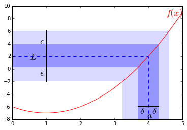

#极限
##**极限(Limits)**  
函数的极限，描述的是输入值在接近一个特定值时函数的表现。

定义：我们若要称函数$$f(x)$$在$$x=a$$处的极限为$$L$$即：$$\lim_{x\rightarrow a}f(x)=L$$，则需要：     
对任意一个$$\epsilon > 0$$，我们要都能找到一个$$\delta >0$$使得当$$x$$的取值满足$$0<|x-a|<\delta$$时$$|f(x)-L|<\epsilon$$  

本节的重点内容其实是用Python画图...：  

```
    f = lambda x: x**2-2*x-6
    x = np.linspace(0,5,100)
    y = f(x)
    
    plt.plot(x,y,'red')
    plt.grid('off')
    
    l = plt.axhline(-8,0,1,linewidth = 2, color = 'black')
    l = plt.axvline(0,0,1,linewidth = 2, color = 'black')
    
    l = plt.axhline(y=2,xmin=0,xmax=0.8,linestyle="--")
    l = plt.axvline(x=4,ymin=0,ymax=float(5)/9, linestyle = "--")
    
    l = plt.axhline(-6,3.7/5,4.3/5,linewidth = 2, color = 'black')
    l = plt.axvline(1,6.0/18,14.0/18,linewidth = 2, color = 'black')
    
    p = plt.axhspan(-2,6,0,(1+sqrt(13))/5,alpha = 0.15, ec = 'none')
    p = plt.axvspan((1+sqrt(5)),(1+sqrt(13)),0,1.0/3,alpha = 0.15, ec = 'none')
    
    p = plt.axhspan(f(3.7),f(4.3),0,4.3/5,alpha = 0.3, ec = 'none')
    p = plt.axvspan(3.7,4.3,0,(f(3.7)+8)/18,alpha = 0.3, ec = 'none')
    
    plt.axis([0,5,-8,10])
    
    
    plt.text(0.8,-1,r"$\epsilon$", fontsize = 18)
    plt.text(0.8,4,r"$\epsilon$", fontsize = 18)
    plt.text(3.75,-7.0,r"$\delta$", fontsize = 18)
    plt.text(4.1,-7.0,r"$\delta$", fontsize = 18)
    plt.text(3.95,-7.8,r"$a$", fontsize = 18)
    plt.text(4.5,8.5,r"$f(x)$", fontsize = 18,color="red")
    
    
    plt.show()
```



下面尝试用上面的定义来证明$$\lim_{x\rightarrow 4}x^2-2x-6=2$$:   
依据定义，我们需要show的是：对于任意$$\epsilon$$,能找到一个$$\delta$$使得：$$0<|x-4|<\delta$$时有$$|f(x)-2|<\epsilon$$  
注意到$$|f(x)-2|=|x^2-2x-6-2|=|(x-4)(x+2)|=|x-4|\cdot|x+2|$$，其中我们已经知道$$|x-4|<\delta$$    
依三角不等式有：$$|x+2|=|x-4+6|\leq|x-4|+6<\delta+6$$  
因此$$|f(x)-2|=|x-4|\cdot|x+2|<\delta\cdot (\delta+6)$$  
现在我们只需要找到一个$$\delta$$满足$$\delta\cdot (\delta+6)\leq\epsilon$$即可  
动用一些中学时候的二元一次方程知识应该很容易证明这样的$$\delta >0$$是存在的，或者我们只要令$$\delta=min(1,\frac{\epsilon}{7})$$即可使得$$\delta \leq \frac{\epsilon}{7}$$且$$\delta +6\leq 7$$，因而$$\delta\cdot (\delta+6)\leq\epsilon$$  

上图中的函数就是$$f(x)=x^2-2x-6$$,并且$$\epsilon=4,\delta=0.3$$  

##**函数的连续性**  
极限可以用来判断一个函数是否为连续函数。  
当极限$$\lim_{x\rightarrow a}f(x)$$存在，且$$\lim_{x\rightarrow a}f(x)=f(a)$$时，称函数$$f(x)$$在点$$x=a$$处为连续的。 当一个函数在其定义域中任何一点处均连续，则称该函数是连续函数。   

##**泰勒级数用于极限计算**  
我们在中学课本中一定记忆了常见的极限，以及极限计算的规则，这里我们便不再赘言。泰勒级数也可以用于计算一些形式比较复杂的函数的极限。这里，仅举一例：   
$$\lim_{x\rightarrow 0}\frac{sin(x)}{x}=\lim_{x\rightarrow 0}{\frac{\frac{x}{1!}-\frac{x^3}{3!}+\frac{x^5}{5!}-\frac{x^7}{7!}+\dots}{x}}$$  
$$\qquad = \lim_{x\rightarrow 0}{\frac{x(1-\frac{x^2}{3!}+\frac{x^4}{5!}-\frac{x^6}{7!}+\dots)}{x}}$$  
$$\qquad = \lim_{x\rightarrow 0}{1-\frac{x^2}{3!}+\frac{x^4}{5!}-\frac{x^6}{7!}+\dots}$$  
$$\qquad = 1$$
