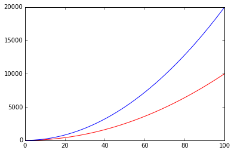

#大O记法
##**大O记法（Big-O Notation）**
我们已经见过了很多函数，在比较两个函数时，我们可能会想知道，随着输入值$$x$$的增长或者减少，两个函数的输出值增长或减少的速度究竟谁快谁慢，哪一个函数最终会远远甩开另一个。  

通过绘制函数图，可以获得一些直观的感受：    
```
	x = range(1,7)

	factorial = [np.math.factorial(i) for i in x]
	exponential = [np.e**i for i in x]
	polynomial = [i**3 for i in x]
	logarithmic = [np.log(i) for i in x]

	plt.plot(x,factorial,'black',\
    	     x,exponential, 'blue',\
        	 x,polynomial, 'green',\
         	 x,logarithmic, 'red')
```

  

根据上图，当$$x\rightarrow \infty$$时：$$x!> e^x> x^3 > ln(x)$$，要想证明的话，可以取极限，例如：$$\lim_{x\rightarrow \infty}\frac{e^x}{x^3}=\infty$$（用洛必达法则计算），表明$$x\rightarrow \infty$$时，虽然分子分母都在趋向无限大，但是分子仍然远远凌驾于分母之上，决定了整个表达式的表现。  
类似地我们也可以这样看：$$\lim_{x\rightarrow \infty}\frac{ln(x)}{x^3}=0$$，表明分母将会远远凌驾于分子之上。  

```
	from sympy.abc import x
	# sympy中无限infty用oo表示
	print ((sympy.E**x)/(x**3)).limit(x,sympy.oo)
	# result is: oo
	print (sympy.ln(x)/x**3).limit(x,sympy.oo)
	# result is 0
```

为了描述这种随着输入$$x\rightarrow \infty$$或$$x\rightarrow 0$$时，函数的表现，我们如下定义大O记法：  
若我们称函数$$f(x)$$在$$x\rightarrow 0$$时是$$O(g(x))$$，则需要找到一个常数$$C$$，对于所有足够小的$$x$$均有$$|f(x)|<C|g(x)|$$  
若我们称函数$$f(x)$$在$$x\rightarrow \infty$$时是$$O(g(x))$$，则需要找到一个常数$$C$$，对于所有足够大的$$x$$均有$$|f(x)|<C|g(x)|$$  

大O记法之所以得此名称，是因为函数的增长速率很多时候被称为函数的**阶（Order）**。  

下面举一例：当$$x\rightarrow \infty$$时，$$x\sqrt{1+x^2}$$是$$O(x^2)$$    

先来个直观感受：  
```
	xvals = np.linspace(0,100,1000)
	f = x*sympy.sqrt(1+x**2)
	g = 2*x**2
	y1 = [f.evalf(subs={x:xval}) for xval in xvals]
	y2 = [g.evalf(subs={x:xval}) for xval in xvals]
	plt.plot(xvals[:100],y1[:100],'r',xvals[:100],y2[:100],'b')
	plt.plot(xvals,y1,'r',xvals,y2,'b')
```

  

  

Sympy可以帮助我们分析一个函数的阶：  
```
	print sympy.O(f, (x, sympy.oo))
	# result is : O(x**2, (x, oo))
```	

计算机学科中使用大O记法，通常是分析当输入数据$$\rightarrow \infty$$时程序在时间或空间方面的表现。  

然而，从上面的介绍，我们知道这个位置可以是$$0$$，甚至可以是任何有意义的位置。  

```
	print sympy.order(f, (x, 0))
	# result is : O(x)
```
##**误差分析（Error Analysis）**  
细心的读者可能曾注意到在泰勒级数一节，我们利用Sympy取函数泰勒级数的前几项时，代码是这样的：

```
	exp = e**x
	sum15 = exp.series(x,0,15).removeO()
```

其中`removeO()`的作用是让sympy忽略掉级数展开后的大O表示项，不然的话结果类似如下：  

```
	print exp.series(x, 0, 3)
	# result is : 1 + 1.0*x + 0.5*x**2 + O(x**3)
```

这表示从泰勒级数的第4项起，剩余所有项在$$x\rightarrow 0$$时是$$O(x^3)$$的。   
这表明，当$$x\rightarrow 0$$时，用$$1+x+0.5x^2$$来近似$$e^x$$，我们得到的误差的上限将是$$Cx^3$$，其中$$C$$是一个常数。  
也就是说大O记法能用来描述我们使用多项式近似时的误差。  

另外，大O记法也可以直接参与计算中去，例如我们要计算$$cos(x^2)\sqrt{(x)}$$在$$x\rightarrow 0$$时阶$$O(x^5)$$以内的多项式近似，可以这样：   

$$cos(x^2)\sqrt{(x)}=(1-\frac{1}{2}x^4+O(x^6))x^{\frac{1}{2}}$$  
$$\qquad = x^{\frac{1}{2}}-	\frac{1}{2}x^{\frac{9}{2}} + O(x^{\frac{13}{2}})$$

```
	print (sympy.cos(x**2)*sympy.sqrt(x)).series(x,0,5)
	# result is : sqrt(x) - x**(9/2)/2 + O(x**5)
```