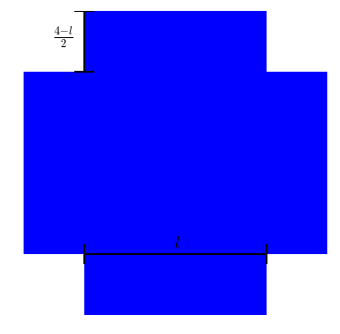

#优化
##**高阶导数（Higher Derivatives）**  
高阶导数的递归式定义为：    
函数$$f(x)$$的$$n$$阶导数$$f^{(n)}(x)$$（或记为$$\frac{d^n}{dx^n}(f)$$）为：  
$$f^{(n)}(x)=\frac{d}{dx}f^{(n-1)}(x)$$      
如果将求导数$$\frac{d}{dx}$$看作是一个运算符，则相当于反复对运算的结果使用$$n$$次运算符：  
$${(\frac{d}{dx})}^nf=\frac{d^n}{dx^n}f$$    

```
	from sympy.abc import x
	from sympy.abc import y
	f = x**2*y-2*x*y
	# 求关于x的二次导数
	print f.diff(x,2)
	# result : 2*y
	# 等同于反复关于x求两次导数
	print f.diff(x).diff(x)
	# result : 2*y
	# 先求关于x的导数，再求关于y的导数，这个该怎么解读？
	print f.diff(x,y)
	# result : 2*(x - 1)
```

##**优化问题（Optimization Problem）**     

很多时候，我们用函数来描述我们关心的问题,例如：    

```
	plt.figure(1, figsize=(6,6))
	plt.axis('off')
	plt.axhspan(0,1,0.2,0.8,ec = "none")
	plt.axhspan(0.2,0.8,0,0.2,ec = "none")
	plt.axhspan(0.2,0.8,0.8,1,ec = "none")

	plt.axhline(0.2,0.2,0.8,linewidth = 2, color = 'black')
	plt.axvline(0.2,0.17,0.23,linewidth = 2, color = 'black')
	plt.axvline(0.8,0.17,0.23,linewidth = 2, color = 'black')

	plt.axvline(0.2,0.8,1,linewidth = 2, color = 'black')
	plt.axhline(0.8,0.17,0.23,linewidth = 2, color = 'black')
	plt.axhline(1,0.17,0.23,linewidth = 2, color = 'black')

	plt.text(0.495,0.22,r"$l$", fontsize = 18,color="black")
	plt.text(0.1,0.9,r"$\frac{4-l}{2}$", fontsize = 18,color="black")

	plt.show()
```
    

用一张给定边长$$4$$的正方形纸来折一个没有盖的纸盒，设纸盒的底部边长为$$l$$，纸盒的高为$$\frac{4-l}{2}$$，那么纸盒的体积为：  
$$V(l)=l^2\frac{4-l}{2}$$     
我们会希望知道怎样才能使得纸盒的容积最大，也就是关心在$$l>0,4-l>0$$,的限制条件下，函数$$V(l)$$的最大值是多少。   
优化问题关心的就是这样的问题，在满足限制条件的前提之下，怎样能够使我们的目标函数最大（或最小）。    
```
		l = np.linspace(0,4,100)
		V = lambda l: 0.5*l**2*(4-l)
		plt.plot(l,V(l))
```
     

通过观察函数图，不难看出，在$$l$$的值大约在$$2.5$$往上去一点的位置处，获得的纸盒的体积最大。    

##**关键点（Critical Points）**  
通过导数一节，我们知道一个函数在某处的导数所描述的是：当输入值在该位置附近变化时，函数值所发生的相应变化。  
因此，如果给定一个函数$$f$$，如果知道在点$$x=a$$处函数的导数不为$$0$$，则在该点出稍微改变函数的输入值，函数值都会变化，这表示函数在该点的函数值即不可能是局部最大值，也不可能是局部最小值。相反，如果函数$$f$$在点$$x=a$$处函数的导数为$$0$$，或者该点出的导数不存在则称这个点就被称为关键点。    

要想知道一个$$f'(a)=0$$的关键点处，函数值$$f(a)$$是一个局部最大值还是局部最小值，可以使用二次导数测试：  
1. 如果$$f''(a)>0$$，则函数$$f$$在$$a$$处的函数值是局部最小值
2. 如果$$f''(a)<0$$，则函数$$f$$在$$a$$处的函数值是局部最大值
3. 如果$$f''(a)=0$$，则测试无法告诉我们结论

二次导数测试在中学书本中，大多是要求不求甚解地记忆的规则，其实理解起来非常容易。二次导数测试中涉及到函数在某一点处的函数值、一次导数和二次导数，于是想$$f(x)$$在$$x=a$$处的泰勒级数：  
$$f(x)=f(a)+f'(a)(x-a)+\frac{1}{2}f''(a)(x-a)^2+\dots$$     
因为$$a$$为关键点，$$f'(a)=0$$，因而：  
$$f(x)=f(a)+\frac{1}{2}f''(a)(x-a)^2+\dots$$    
表明$$f''(a)\neq 0$$时，函数$$f(x)$$在$$x=a$$附近的表现近似于二次函数，二次项的系数$$\frac{1}{2}f''(a)$$决定了抛物线的开口朝向，因而决定了函数值在该点是怎样的。  

回到之前的求最大盒子体积的优化问题，解法如下：
```
	from sympy.abc import l
	V = 0.5*l**2*(4-l)
	# 看看一次导函数：
	print V.diff(l)
	# output is : -0.5*l**2 + 1.0*l*(-l + 4)
	# 一次导函数的定义域为(-oo,oo),因此关键点为V'(l)=0的根
	cp = sympy.solve(V.diff(l),l)
	print cp
	# output is: [0.0, 2.66666666666667]
	# 找到关键点后，使用二次导数测试：
	for p in cp:
		print V.diff(l,2).subs(l,p)
	# output is: 4, -4
	# 因此知道在l=2.666666处时，纸盒的体积最大
```

##**线性回归（Linear Regression）**    
二维平面上有$$n$$个数据点，$$p_i=(x_i,y_i)$$，现尝试找到一条经过原点的直线$$y = ax$$，使得所有数据点到该直线的残差（数据点和回归直线之间的水平距离）的平方和最小。

```
	# 设定好随机函数种子，确保模拟数据的可重现性
	np.random.seed(123)
	
	# 随机生成一些带误差的数据
	x = np.linspace(0,10,10)
	res = np.random.randint(-5,5,10)
	y = 3*x + res
	
	# 求解回归线的系数
	a = sum(x*y)/sum(x**2)
	
	# 绘图
	plt.plot(x,y,'o')
	plt.plot(x,a*x,'red')
	for i in range(len(x)):
		plt.axvline(x[i],min((a*x[i]+5)/35.0,(y[i]+5)/35.0),\
			 max((a*x[i]+5)/35.0,(y[i]+5)/35.0),linestyle = '--',\
			 color = 'black')
```


要找到这样一条直线，实际上是一个优化问题：    
$$\underset{a}{min}Err(a)=\sum_{i}{(y_i-ax_i)}^2$$    
要找出函数$$Err(a)$$的最小值，首先计算一次导函数：  
$$\frac{dErr}{da}=\sum_{i}2(y_i-ax_i)(-x_i)$$   
$$\qquad = -2\sum_{i}x_iy_i + 2a\sum_{i}x_i^2$$   
令该函数为$$0$$，求解出关键点：
$$a = \frac{\sum_{i}x_iy_i}{\sum_{i}x_i^2}$$    
使用二次导数测试：   
$$\frac{d^2Err}{da^2}=2\sum_ix_i^2>0$$   
因此$$a = \frac{\sum_{i}x_iy_i}{\sum_{i}x_i^2}$$是能够使得函数值最小的输入。    

这也是上面Python代码中，求解回归线斜率所用的计算方式。   

如果我们不限定直线一定经过原点，即公式为$$y=ax+b$$，则同样还是一个优化问题，只不过涉及的变量变成2个而已：  
$$\underset{a}{min}Err(a,b)=\sum_i{(y_i-ax_i-b)}^2$$  
这个问题就是多元微积分里所要分析的问题了。    