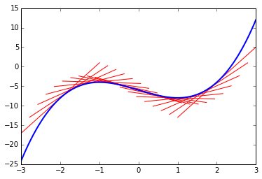

#不定积分
##**常微分方程（Ordinary Differential Equations, ODE）**   
我们观察一辆行驶中的汽车，假设我们发现函数$$a(t)$$能够很好地描述这辆汽车在各个时刻的加速度，因为对速度的时间函数求导可以得到加速度的时间函数，如果我们希望根据$$a(t)$$求出$$v(t)$$，很自然会得出下面这个方程：    
$$\frac{dv}{dt}=a(t)$$   


如果我们能够找到一个函数$$v(t)$$满足：$$\frac{dv}{dt}=a(t)$$，那么$$v(t)$$就是上面方程的解之一。因为对于常数项求导的结果是0，一旦我们找到了一个$$v(t)$$是方程的解，那么$$\forall C\in\mathbb{R}, v(t)+C$$也都是方程的解，因此常微分方程的解是$$v(t)+C$$这样的一系列函数。

在得出这一系列函数后，我们只需要知道任意一个时刻里汽车行驶的速度，便可以求解出常数项$$C$$，因而得到最终想求的速度时间函数。  

如果我们沿用导数是函数在某个位置的切线斜率的解读去看上面的常微分方程，就像是我们知道了一个函数在各个位置的切线斜率，反过来求这个函数一样。

```
    t = sympy.Symbol('t')
    c = sympy.Symbol('c')
    domain = np.linspace(-3,3,100)
    v = t**3-3*t-6
    a = v.diff()
    
    for p in np.linspace(-2,2,20):
        slope = a.subs(t,p)
        intercept = sympy.solve(slope*p+c-v.subs(t,p),c)[0]
        lindomain = np.linspace(p-1,p+1,20)
        plt.plot(lindomain,slope*lindomain+intercept,'red',linewidth = 1)
        
    plt.plot(domain,[v.subs(t,i) for i in domain],linewidth = 2)
```


数学家发明并研究积分的一个重要目的便是为了方便地求解微分方程。

##**不定积分（Indefinite Integral）**

如果我们将求导看作一个高阶函数，输入进一个函数，求导后得到一个新的函数。那么不定积分可以被视为是对应的“反函数”，$$F'(x)=f(x)$$，则$$\int f(x)dx=F(x)+C$$。写成类似反函数之间复合的形式有：  
$$\int((\frac{d}{dx}F(x))dx)=F(x)+C$$   
其中$$C$$为常数。   

积分的规则和技巧，例如换元积分、分部积分等就累给读者去回顾吧，这里仅介绍下Python中的方法。    

```
    print a.integrate()
    # result is: t**3 - 3*t
```


